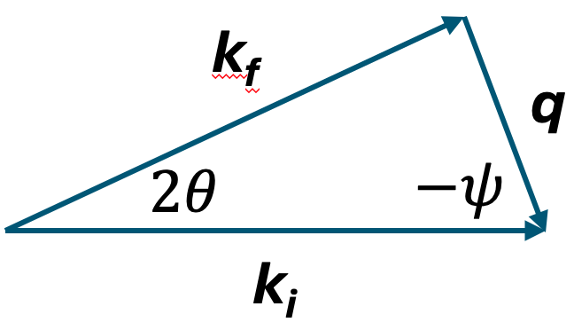

Triple-Axis Library
===================

The ``tavi.library`` triple-axis stack provides the in-memory representation of a
triple-axis spectrometer (TAS) and the resolution calculations performed on top
of it. This page documents the modules added in the Cooper-Nathans resolution
branch.

Core Concepts
-------------

The stack is organised around five classes:

- **Instrument** (``Instrument``)
  Container holding the spectrometer components (monochromator, analyzer,
  collimators, goniometer).

- **Components** (``Crystal``, ``Collimators``, ``Goniometer``)
  Reusable hardware abstractions used by ``Instrument`` and consumed by the
  resolution calculation.

- **Experiment** (``Experiment``)
  Owns the loaded scans (``TaviData``) and a loader, tracks the fixed-energy mode
  (``FixedEnergyMode``), and exposes the geometric quantities derived from the
  data (two-theta, psi, peak centers).

- **Resolution** (``Resolution``, ``CooperNathans``, ``ResolutionEllipsoid``)
  Computes the 4D resolution matrix and ``r0`` normalisation factor and
  projects them into user-selected frames.

- **TAS** (``TAS``)
  Top-level façade tying ``Instrument``, ``Sample``, and ``Experiment``
  together for downstream calculations.

Architecture Overview
---------------------

Components by responsibility:

- ``tavi.library.Instrument.instrument.Instrument`` -- aggregate spectrometer
- ``tavi.library.component.crystal.Crystal`` -- monochromator/analyzer crystals
- ``tavi.library.component.collimators.Collimators`` -- soller-slit divergences
- ``tavi.library.component.goniometer.Goniometer`` -- sample stage
- ``tavi.library.experiment.experiment.Experiment`` -- scan-derived geometry
- ``tavi.library.resolution.resolution.Resolution`` -- resolution manager
- ``tavi.library.resolution.cooper_nathans.CooperNathans`` -- Cooper-Nathans model
- ``tavi.library.resolution.ellipsoid.ResolutionEllipsoid`` -- 4D ellipsoid + projection
- ``tavi.library.tas.triple_axis.TAS`` -- top-level entry point

Instrument
----------

``Instrument`` aggregates the optical and mechanical components of the
spectrometer.

Constructor arguments (all optional):

- ``monochromator`` (``Crystal``) -- pre-sample crystal
- ``analyzer`` (``Crystal``) -- post-sample crystal
- ``collimators`` (``Collimators``) -- four sets of horizontal and vertical divergences
- ``goniometer`` (``Goniometer``) -- sample stage with scattering sense
- ``instrument_catalog`` (``InstrumentCatalog``) -- when given, loads all four
  components from that instrument's JSON parameter file, overwriting anything
  passed explicitly

.. note::

   The monochromator is stored on the attribute ``monochromater`` (note the
   spelling) and the goniometer on ``goni``. ``Resolution`` and
   ``TAS.resolution_bar`` read them under those names.

Example -- explicit components:

.. code-block:: python

    from tavi.library.Instrument.instrument import Instrument
    from tavi.library.component.crystal import Crystal
    from tavi.library.component.collimators import Collimators
    from tavi.library.component.goniometer import Goniometer

    instrument = Instrument(
        monochromator=Crystal(crystal="PG002", sense="+"),
        analyzer=Crystal(crystal="PG002", sense="-"),
        collimators=Collimators(pre_mono_h=40, pre_sample_h=100),
        goniometer=Goniometer(type="Y,-Z,X", s2_sense="+"),
    )

Example -- loaded from the catalog:

.. code-block:: python

    from tavi.library.Instrument.instrument import Instrument, InstrumentCatalog

    instrument = Instrument(instrument_catalog=InstrumentCatalog.HB1ATAS)

Instrument Catalog
~~~~~~~~~~~~~~~~~~

``InstrumentCatalog`` enumerates the supported HFIR instruments and maps each to
a JSON parameter file under
``tavi/library/Instrument/instrument_parameters/ORNL/``:

======================================  ====================  ==================
``InstrumentCatalog`` member            Local name            Parameter file
======================================  ====================  ==================
``CG4C``                                CTAX                  ``cg4c.json``
``HB1``                                 PTAX                  ``hb1.json``
``HB1ATAS``                             HB1A TAS mode         ``hb1a_tas.json``
``HB1A4C``                              HB1A 4 circle mode    ``hb1a_4c.json``
``HB3``                                 TAX                   ``hb3.json``
======================================  ====================  ==================

Only the ``monochromator``, ``analyzer``, ``collimators`` and ``goniometer``
sections of each file are used to build components; the remaining sections
(``source``, ``guide``, ``monitor``, ``detector``, ``distances``) are parsed but
ignored by the Cooper-Nathans path. Passing a catalog member with no mapping
raises ``ValueError("instrument parameters not defined")``.

Components
----------

Crystal
~~~~~~~

``Crystal`` represents a monochromator or analyzer crystal. It carries a
mosaic (horizontal/vertical), a crystal type, and a scattering sense.

Constructor arguments:

- ``mosaic_h``, ``mosaic_v`` (``float``) -- mosaic FWHM in arc-minutes, default 30
- ``crystal`` (``str``) -- e.g. ``"PG002"``, ``"Cu220"``, ``"Heusler"``; default ``"PG002"``
- ``sense`` (``"+"`` or ``"-"``) -- scattering sense, default ``"-"``
- ``d_spacing`` (``float``) -- fallback d-spacing used only when ``crystal`` is not
  a known key; default ``0``

The supported crystals and their d-spacings (in angstrom) are listed in
``crystal_d`` at the top of ``crystal.py``: ``PG002``, ``Pg002``, ``PG004``,
``Cu111``, ``Cu220``, ``Ge111``, ``Ge220``, ``Ge311``, ``Ge331``, ``Be002``,
``Be110``, ``Heusler``, ``Si111``. Lookup is exact, which is why both ``PG002``
and ``Pg002`` are present -- the ORNL parameter files use each spelling in
different sections. For a crystal not listed, pass any name plus an explicit
``d_spacing``; ``crystal_d.get(crystal, d_spacing)`` falls back to it.

``mosaic_h`` / ``mosaic_v`` are stored as given but the properties return
radians (arc-minutes / 60, then ``np.radians``), matching ``Collimators``.
``sense`` likewise returns ``+1`` / ``-1`` rather than the string it was set with.

``theta(ei)`` returns half the crystal's scattering angle in radians from Bragg's
law, :math:`\theta = \arcsin(\pi / (d k))`.

Collimators
~~~~~~~~~~~

``Collimators`` holds the horizontal and vertical divergence (in arc-minutes,
stored internally and exposed as radians) for the four soller slits:

- ``pre_mono_h`` / ``pre_mono_v``
- ``pre_sample_h`` / ``pre_sample_v``
- ``post_sample_h`` / ``post_sample_v``
- ``post_ana_h`` / ``post_ana_v``

Properties return values in radians (divided by 60 and converted via
``np.radians``) for direct use in matrix calculations.

Goniometer
~~~~~~~~~~

The goniometer carries the scattering sense (``+`` or ``-``) used to sign
``two_theta`` and ``psi`` in geometric calculations, and a ``type`` string
naming the stacking order of its rotation axes.

``r_mat(angles)`` turns a ``MotorAngles`` into the sample rotation matrix
:math:`R` needed to project resolution into an ``hkle`` frame. It dispatches on
``type`` with a ``match`` statement, so the string must equal one of the
implemented cases *exactly* -- and those contain **no spaces**:

- ``"Y,-Z,X"`` -- Huber table. Consumes ``omega``, ``sgl``, ``sgu`` as
  :math:`R_y(\omega) R_z(sgl) R_x(sgu)`.
- ``"Y,Z,Y,bisect"`` -- four-circle in bisect mode. Consumes ``omega``, ``chi``,
  ``phi`` as :math:`R_y(\omega) R_z(\chi) R_y(\phi)`.

Any other value raises ``ValueError("Unknown mode.")``.

.. warning::

   ``Goniometer.__init__`` defaults ``type`` to ``"Y, -Z, X"`` -- **with spaces**
   -- which matches neither case. So does the fallback in
   ``Instrument._load_instrument`` when a parameter file has no ``goniometer.type``
   entry. A goniometer left on the default therefore cannot produce a rotation
   matrix, and ``hkle`` resolution fails with ``"Unknown mode."``.

   The shipped parameter files all set ``type`` explicitly and correctly:
   ``hb1.json``, ``hb1a_tas.json``, ``hb3.json`` and ``cg4c.json`` declare
   ``"Y,-Z,X"``, and ``hb1a_4c.json`` declares ``"Y,Z,Y,bisect"``. Constructing
   an ``Instrument`` from ``InstrumentCatalog`` is therefore the safe route;
   hand-built goniometers must pass ``type`` explicitly.

The sign prefix on each axis token is read separately by ``_get_motor_senses``
and applied to the corresponding motor angle (``+`` for CCW, ``-`` for CW). The
Cartesian convention is Mantid's / the International Tables': :math:`Z` along the
incoming beam, :math:`Y` up, :math:`X` in plane, right-handed.

Two further methods exist for the four-circle path:
``angles_from_r_mat(r_mat)`` inverts the YZX rotation back to
``(omega, sgl, sgu)``, and ``verify_motor_angles(q_vec, two_theta, psi)``
computes bisect-mode motor angles for a target ``Q`` (implemented for
``"Y,Z,Y,bisect"`` only; anything else raises
``ValueError("Not implemented yet.")``).

Experiment
----------

``Experiment`` owns the scans it has loaded, records which energy is held fixed,
and exposes the geometric quantities needed by the resolution machinery.

Constructor arguments:

- ``mode`` (``FixedEnergyMode``) -- ``FixedEnergyMode.FIX_Ei`` or
  ``FixedEnergyMode.FIX_Ef``; defaults to ``FixedEnergyMode.FIX_Ef``
- ``fixed_energy`` (``float``) -- value of the fixed energy in meV; defaults to 0
- ``loader`` (``AbstractLoader``) -- defaults to
  ``ORNLSpiceLoader(LocalFileStore())``

There is **no** ``scan`` argument. Scans are ingested afterwards with
``load_file(path)`` / ``load_folder(path)`` and held in ``self.tavi_data.raw_scans``,
keyed by uuid. Every derived-quantity method dispatches on ``type(self.loader)``
and raises ``ValueError("Loader not implemented.")`` for anything that is not an
``ORNLSpiceLoader``.

``FixedEnergyMode`` lives in ``tavi.library.experiment.enum``. It is an ``Enum``
with exactly two members; only enum members are accepted (raw strings are not).

Methods:

.. code-block:: python

    def load_file(file_path: str) -> None
        """Load one scan into tavi_data.raw_scans."""

    def load_folder(folder_path: str) -> None
        """Load every *.dat file in a folder, in sorted order."""

    def get_two_theta(q_norm: float, ei: float, ef: float) -> float
        """Scattering angle from ki, kf, and |Q|."""

    def get_psi(q_norm: float, ei: float, ef: float) -> float
        """Angle between ki and Q (sign applied by the caller)."""

    def set_fixed_energy(e: float) -> None
        """Assign ``e`` to ``ei`` or ``ef`` based on ``mode``."""

    def get_ei_ef(e: float) -> tuple[float, float]
        """Return ``(ei, ef)`` given the complementary energy ``e``."""

    def get_peak_center(scan_identifier, fit_package, model_dict) -> list[DataPoint]
        """One DataPoint per fitted peak center."""

    def get_closest_to_center_data_point(scan_identifier, fit_package, model_dict) -> list[DataPoint]
        """The measured point nearest each fitted center (real motor angles)."""

    def get_hkl(scan_identifier, use_title=True, model_dict=[]) -> np.ndarray
        """(h, k, l) from the scan title, or from a fit when the title cannot be parsed."""

    def get_delta_q(scan_identifier) -> np.ndarray
        """Delta-q abscissa for a scan."""

    def get_data_from_scan_number(scan_identifier) -> RawScan
        """Look a loaded scan up by number; raises if zero or several match."""

    def create_sample(ub_path: str) -> Sample
        """Build a Sample (oriented lattice + UB) from a UBConf file."""

``scan_identifier`` is a dict with a required ``"scan_num"`` key and optional
``"IPTS"`` / ``"exp_num"`` keys used to disambiguate.

Both angles are derived from a triangle solve using ``ki = SE2K(ei)`` and
``kf = SE2K(ef)``. The scattering triangle in k-space (``Q = ki - kf``) is:

where :math:`2\theta` is the scattering angle between :math:`k_i` and
:math:`k_f` (returned by ``get_two_theta``) and :math:`\psi` is the angle
between :math:`k_i` and :math:`Q` (returned by ``get_psi``).

Sign conventions are applied by the caller (``Resolution``) based on
instrument/goniometer sense.

Example:

.. code-block:: python

    from tavi.library.experiment.enum import FixedEnergyMode
    from tavi.library.experiment.experiment import Experiment

    experiment = Experiment(mode=FixedEnergyMode.FIX_Ef, fixed_energy=4.8)
    experiment.load_folder("/path/to/exp1091/Datafiles")

Resolution
----------

``Resolution`` is the entry point for resolution calculations. It selects a
model, gathers geometry from the experiment and instrument, and optionally
projects the resulting matrix into user selected axes.

Constructor arguments:

- ``model`` (``ResolutionModel``) -- an enum member, **not** a string.
  ``ResolutionModel`` declares ``CooperNathans = "Cooper-Nathans"`` and
  ``Popvic = "Popvic"``, but only ``ResolutionModel.CooperNathans`` is
  implemented; anything else raises
  ``ValueError(f"Unknown resolution model '{model}'. Choose from: 'CooperNathans'.")``
- ``instrument`` (``Instrument``)
- ``sample`` (``Sample``)
- ``experiment`` (``Experiment``)
- ``scan_idx``, ``pt_idx`` (``int``) -- scan/point indices, default 0
- ``resolution_frame`` (``str | tuple``) -- ``"local"`` for the local :math:`Q`
  frame, or a 4-tuple of projection axes whose last entry is ``"e"`` for energy.
  Defaults to ``((1, 0, 0), (0, 1, 0), (0, 0, 1), "e")`` (the plain HKL frame).
  Stored on the instance as ``self.axes``. See :ref:`resolution_frame`.

.. note::

   The default differs by entry point. ``Resolution`` itself defaults to the
   plain HKL frame, while ``TAS.browse`` and ``TAS.resolution_bar`` default to
   ``"local"`` and pass that through.

Key methods:

.. code-block:: python

    def get_resolution(
        hkl: tuple[float, float, float],
        ei: float,
        ef: float,
        rot_mat: Optional[np.ndarray] = None,
    ) -> tuple[np.ndarray, float]
        """Resolution matrix + r0 at ``hkl``, optionally projected via ``rot_mat``."""

    def get_ellipse(
        res_mat: np.ndarray,
        ellipse_axes: tuple[int, int] = (0, 1),
        PROJECTION: bool = False,
        ORIGIN: bool = True,
    ) -> tuple[np.ndarray, float]
        """2D ellipse by slice or projection, plus the angle between its axes."""

    def get_projection(
        res_mat: np.ndarray,
        projection_axes: int | tuple,
        PROJECTION: bool = False,
    ) -> np.ndarray
        """Reduce a 4D matrix to any subset of axes, keeping ``projection_axes``."""

    def get_axes_angles() -> tuple[float, float, float]
        """Angles between the basis vectors of the current frame."""

``get_resolution`` always returns a ``(res_mat, r0)`` pair. When
``resolution_frame`` is ``"local"`` (or falsy) that is the raw matrix in the
local Q frame and ``rot_mat`` is ignored. Otherwise it constructs a
``ResolutionEllipsoid`` and calls ``project_to_frame``; ``rot_mat`` may be
supplied by the caller -- ``TAS.resolution_bar`` passes
``Goniometer.r_mat(angles)`` -- and is otherwise derived from
``sample.ol.rot_matrix_with_minimal_tilt``, which requires ``UB``,
``plane_normal`` and ``in_plane_ref`` to be set.

``get_axes_angles`` returns ``(90, 90, 90)`` for the local frame, the reciprocal
angles :math:`(\gamma^*, \alpha^*, \beta^*)` for the plain HKL frame, and the
angles between the user's projection vectors otherwise. Coplanar projection
vectors raise ``ValueError``.

``get_projection`` generalises ``get_ellipse`` to an arbitrary set of retained
axes; pass ``projection_axes`` as a tuple of indices to keep.

CooperNathans
~~~~~~~~~~~~~

``CooperNathans`` implements the Popovici 1975 formulation. It builds the
matrices ``G`` (collimator divergence), ``F`` (mosaic), ``C`` (crystal
geometry), and ``A``/``B`` (lab-frame projection) used to assemble the 4D
resolution matrix and the ``r0`` normalisation factor.

Class attributes:

- ``NUM_MONO``, ``NUM_ANA`` -- one each
- ``NUM_COLLS = 4`` -- four soller slits
- ``IDX_COLLS`` -- index map for horizontal/vertical entries in ``G``

The main entry point is:

.. code-block:: python

    def resolution_matrix(
        instrument: Instrument,
        sample: Sample,
        q_norm: float,
        ki: float,
        kf: float,
        psi: float,
        two_theta: float,
        theta_m: float,
        theta_a: float,
    ) -> tuple[np.ndarray, float]

ResolutionEllipsoid
~~~~~~~~~~~~~~~~~~~

``ResolutionEllipsoid`` wraps the 4D resolution matrix and the ``r0``
normalisation along with the frame, taken as ``resolution_frame`` and stored as
``self.axes``. ``project_to_frame(r_mat, psi, ub)`` rotates the matrix into the
requested ``hkle`` frame and returns ``(res_mat_proj, r0)``. For the default
``((1,0,0),(0,1,0),(0,0,1),"e")`` the conversion is
:math:`2\pi\,R_{lab \leftarrow local} R\, UB`; for any other 4-tuple it is
further multiplied by the user basis :math:`W = [w_1\ w_2\ w_3]`. The axis order
is the tuple order -- there is no separate permutation step, so listing the
vectors in a different order is how an axis is moved.

Widths are extracted with ``coh_fwhm(projection_axis)`` (a cut, straight off the
diagonal) and ``incoh_fwhm(projection_axis)`` (an integral, the other three axes
removed via ``quadric_proj`` first). Both index the frame the ellipsoid was
constructed with. See :ref:`projection_axis`.

TAS
---

``TAS`` is the top-level façade combining ``Instrument``, ``Sample``, and
``Experiment``.

Constructor arguments:

- ``instrument`` (``Instrument``)
- ``sample`` (``Sample``)
- ``experiment`` (``Experiment``) -- optional
- ``ub_convention`` (``UBConvention``) -- ``UBConvention.Spice`` (default) or
  ``UBConvention.Mantid``
- ``plugin`` -- optional instrument-specific plugin used for data reduction
  (e.g. ``tavi.library.plugin.hb1a_plugins.VERITAS``)

Public methods:

``ub(peaks, scattering_plane=None, reset_ub=False)``
    UB determination from 1, 2, 3 or more peaks, delegating to ``UBAlgorithm``.
    A single peak requires ``scattering_plane``. ``reset_ub=True`` writes the
    result back onto ``sample.ol.UB``.

``resolution_bar(scan_list, ...)``
    Coherent FWHM per fitted peak per scan, plus the 4D matrices. Constructs its
    own ``Resolution`` internally.

``browse(scan_list, ...)``
    Renders the scans through ``browse_scans``, optionally with resolution bars.

``browse_resolution_ellipse(scan_list, ...)``
    Plots the :math:`(Q_\parallel, Q_\perp)` ellipse per scan, always in the
    local :math:`Q` frame.

There is **no** ``get_resolution_at_hkle`` method, and no separate
``calculate_resolution`` setup step. ``resolution_bar`` and
``browse_resolution_ellipse`` each build the ``Resolution`` they need and leave
it on ``self.resolution`` as a side effect. To evaluate resolution at a single
arbitrary point, construct ``Resolution`` directly:

.. code-block:: python

    from tavi.library.resolution.resolution import Resolution, ResolutionModel
    from tavi.library.tas.triple_axis import TAS

    tas = TAS(instrument=instrument, sample=sample, experiment=experiment)

    res = Resolution(
        model=ResolutionModel.CooperNathans,
        instrument=tas.instrument,
        sample=tas.sample,
        experiment=tas.experiment,
        resolution_frame="local",
    )
    res_mat, r0 = res.get_resolution(hkl=(0, 0, 3), ei=4.8, ef=4.8)

Usage Examples
--------------

Resolution at a Single Point
~~~~~~~~~~~~~~~~~~~~~~~~~~~~

.. code-block:: python

    from tavi.library.resolution.resolution import Resolution

    res = Resolution(
        model=ResolutionModel.CooperNathans,
        instrument=instrument,
        sample=sample,
        experiment=experiment,
        resolution_frame="local",
    )
    res_mat, r0 = res.get_resolution(hkl=(0, 0, 3), ei=4.8, ef=4.8)

Projecting onto a User Frame
~~~~~~~~~~~~~~~~~~~~~~~~~~~~

.. code-block:: python

    res = Resolution(
        model=ResolutionModel.CooperNathans,
        instrument=instrument,
        sample=sample,
        experiment=experiment,
        resolution_frame=((1, 1, 0), (0, 0, 1), (1, -1, 0), "e"),
    )
    # Explicit rotation matrix from the measured motor angles...
    rot_mat = instrument.goni.r_mat(data_point.angles)
    res_proj, r0 = res.get_resolution(hkl=(0, 0, 3), ei=4.8, ef=4.8, rot_mat=rot_mat)

    # ...or leave it to the minimal-tilt derivation from UB.
    res_proj, r0 = res.get_resolution(hkl=(0, 0, 3), ei=4.8, ef=4.8)

Reducing to a 2D Ellipse
~~~~~~~~~~~~~~~~~~~~~~~~

.. code-block:: python

    res_2d_slice, axes_angle = res.get_ellipse(res_mat, ellipse_axes=(0, 3), PROJECTION=False)
    res_2d_proj,  axes_angle = res.get_ellipse(res_mat, ellipse_axes=(0, 3), PROJECTION=True)

``get_ellipse`` returns a 2-tuple: the 2x2 matrix and the angle (in degrees)
between the two kept basis vectors, which ``PlotResolution`` uses to skew the
grid. ``PROJECTION=False`` slices the matrix (integrates the unselected axes out by
deletion), while ``PROJECTION=True`` projects via the quadric-projection
identity (``quadric_proj``).

Plotting
--------

Plotting is split across two modules:

- ``tavi.library.plot.browser`` -- ``browse_scans``, the grid-of-scans browser
  with fits, per-component curves and resolution bars. Documented in
  :ref:`scan_browser`.
- ``tavi.library.plot.plot_ellipse`` -- resolution-ellipse rendering only.

The split keeps ``plot_ellipse`` free of the ``Experiment``/``Fit`` imports the
browser needs, so the ellipse plotting stays a leaf module.

Plot Ellipse
~~~~~~~~~~~~

``tavi.library.plot.plot_ellipse`` provides two public objects for rendering
2D resolution ellipses on a skewed (non-orthogonal) grid:

- **``grid_helper(angle, nbins)``** -- builds a ``GridHelperCurveLinear`` that
  skews the Matplotlib axes by ``angle`` degrees, so that non-orthogonal
  reciprocal-space axes are drawn correctly.
- **``PlotResolution``** -- accumulates one or more ``EllipseEntry`` objects and
  renders them together on a single axes. ``PlotResolution.plot_resolution_ellipse``
  is a separate classmethod -- the batch helper used by
  ``TAS.browse_resolution_ellipse``, which lays out a grid of subplots (one per
  peak) rather than accumulating onto one axes.

``EllipseEntry`` dataclass fields:

- ``patch`` (``Ellipse``) -- the Matplotlib patch to draw
- ``x_extent``, ``y_extent`` (``float``) -- half-widths of the bounding box
  in data coordinates, used to auto-scale the axes limits
- ``origin`` (``tuple[float, float]``) -- centre of the ellipse in data coordinates

``PlotResolution`` API
~~~~~~~~~~~~~~~~~~~~~~

.. code-block:: python

    class PlotResolution:
        def __init__(self, axes_angle: float) -> None: ...
        """
        axes_angle: angle (degrees) between the two plot axes.
        """

        @staticmethod
        def create_ellipse(
            mat: np.ndarray,
            origin: tuple[float, float] = (0.0, 0.0),
            **kwargs,
        ) -> EllipseEntry: ...
        """
        Compute the FWHM ellipse from a 2x2 resolution matrix.
        Eigen-decomposition gives the semi-axes lengths and orientation angle.
        sig2fwhm is applied so dimensions are full-width values.
        """

        def add_ellipse(
            self,
            mat: np.ndarray,
            origin: tuple[float, float] = (0.0, 0.0),
            **kwargs,
        ) -> EllipseEntry: ...
        """Convenience wrapper: create_ellipse + append to the draw queue."""

        def plot(
            self,
            ax: Optional[Axes] = None,
            pad: float = 1.1,
            show: bool = True,
        ) -> Axes: ...
        """
        Draw all queued ellipses.  Creates a new figure with a skewed grid
        if ax is None.  Applies the shear transform so that patches are
        rendered in the tilted coordinate system.  A legend is shown
        automatically when any patch carries a visible label.
        """

Example
~~~~~~~

.. code-block:: python

    from tavi.library.plot.plot_ellipse import PlotResolution

    # res_2d is a 2×2 slice/projection from res.get_ellipse(...)
    p = PlotResolution(axes_angle=60.0)          # 60° between the two axes
    p.add_ellipse(res_2d, label="(0,0,3)")
    p.add_ellipse(res_2d_proj, origin=(0.05, 0.0), linestyle="--", label="projected")
    ax = p.plot(show=True)

Multiple ellipses (e.g. along a scan) can be added with different ``origin``
values before a single call to ``plot``.

Design Characteristics
----------------------

- **Composition over inheritance** -- ``Instrument`` aggregates components.
- **Model selection at runtime** -- ``Resolution`` dispatches on ``model``;
  Cooper-Nathans is currently the only implementation.
- **Frame-agnostic core** -- resolution matrix is computed in local Q;
  projection is a separable step via ``ResolutionEllipsoid``.
- **Sign conventions centralised** -- ``Resolution`` applies the goniometer/
  monochromator/analyzer ``sense`` to angles before handing off to the model.

Future Considerations
---------------------

- Additional resolution models. ``ResolutionModel.Popvic`` is declared but not
  implemented; Eckold-Sobolev and Monte Carlo are unimplemented.
- Vectorised resolution evaluation across a scan.
- Caching of intermediate matrices when ``hkl`` varies but ei/ef are fixed.
- Plotting the incoherent FWHM. ``TAS.resolution_bar`` already computes it for
  ``hkle`` frames but only prints it.
- Loaders other than ``ORNLSpiceLoader``. ``Experiment`` and ``TAS`` currently
  raise ``ValueError`` for any other loader.

Loading instrument defaults from JSON is **implemented** -- see
`Instrument Catalog`_.
