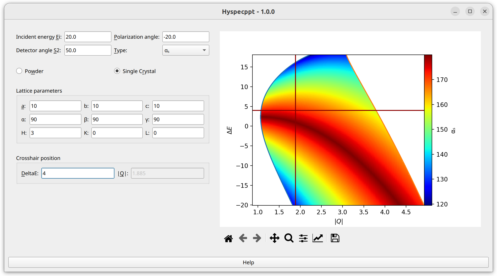

.. _gui:

Graphical user interface
########################

As of version 1.0.0 the graphical user interface for the planning tool looks like

The user is supposed to select the incident energy, detector tank angle, and the angle between polarization and the
beam direction. This will generate a map of the angle between the polarization and momentum transfer :math:`\alpha_s`, or some
relevant derived quantity. Currently we have implemented :math:`\cos^2\alpha_s` and :math:`(1+\cos^2\alpha_s)/2`.

The user can position a crosshair at a certain momentum and energy transfer position, in order to test several possible polarization directions.
In the single crystal mode, the magnitude of momentum transfer :math:`|\vec Q|` is provided via lattice parameters and reciprocal
lattice coordinates. In the powder mode, the user enters this quantity directly.

One can use the plotting toolbar to
* zoom in/out/pan
* change the color range, by zooming on the colorbar
* change the colormap. Click on edit axes, customize the default plot, click on the Images tab.

Validation
----------

The graphical user interface will provide a visual feedback (red border) if some of the quantities required for calculations are missing
or outside acceptable limits. The tooltips provide this information. In addition, in the single crystal mode, the sum of the lattice angles must be greater than :math:`360^\circ`, and the sum of any two angles must be greater than the remaining one.

Negative energy transfer
------------------------

By default, the energy transfer range for the plot is given by the incident energy :math:`E_i`, from :math:`-E_i` to :math:`E_i`.
If the energy transfer of the crosshair is selected to be less than :math:`-E_i`, the new minimum will be :math:`-1.2\Delta E`.
