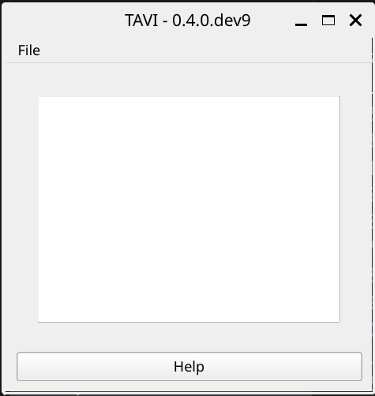

.. _gui:

Graphical user interface
########################

The TAVI application window is built by ``TaviView.build_ui`` from four
independently-owned sub-views arranged in a horizontal splitter.

Layout
------

**Left panel**
   The :doc:`project tree <design/frontend/project_view>` (``ProjectView``) over a
   filter panel (``FilterView``). The tree holds four fixed roots — ``Raw``,
   ``Combined``, ``Fits`` and ``Plots`` — under which loaded scans and saved plots
   appear.

**Center panel**
   A tab widget whose only tab today is **1D Plotter** (``Plot1DView``): the
   matplotlib canvas plus the axis, rebin and preset (normalization) controls, and
   the **Add Plot** button that saves the currently rendered plot into the project.

**Right panel**
   A tab widget whose only tab today is **Data File**
   (:doc:`DataFileView <design/frontend/data_file_view>`): the focused scan's column
   table, a variable checklist that shows/hides columns, and a tabbed metadata
   panel.

**Menu bar**
   A single **File** menu (``FileMenu``) with New Project, Load Project, Recent
   Projects, Load Experiment Folder, Load Data File(s), Save Project and Exit.
   Only *Load Experiment Folder* and *Exit* are wired to the backend today; the
   remaining actions are placeholders.

Typical workflow
----------------

#. **File → Load Experiment Folder** and pick a folder of SPICE ``.dat`` files.
   Each file is classified, loaded, and appended under the ``Raw`` tree root.
#. Select a scan in the tree. The Data File panel shows its columns and metadata,
   and the 1D Plotter renders it using the scan's default x/y axes.
#. Adjust the axis or preset (normalization) fields to re-plot.
#. Click **Add Plot** to persist the current plot as its own entry under the
   ``Plots`` tree root. It can be re-selected later to render again.
#. Right-click one or more tree entries and choose **Remove Item** to delete them.

Errors
------

Backend failures never reach the GUI as raw exceptions. They are wrapped as
``TaviError`` subtypes, published as an ``ExceptionEvent``, and routed by the
``RecoveryService`` to a registered handler. The frontend handler
(``ErrorPresenter``) logs the error and shows a critical ``TaviMessageBox``
pop-up. See :doc:`design/recovery_service` for the full mechanism.
